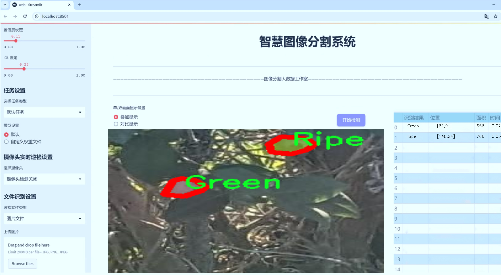
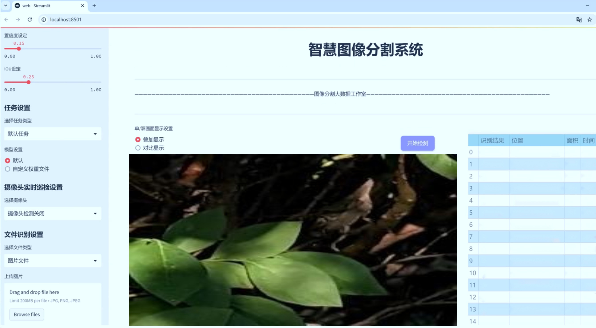
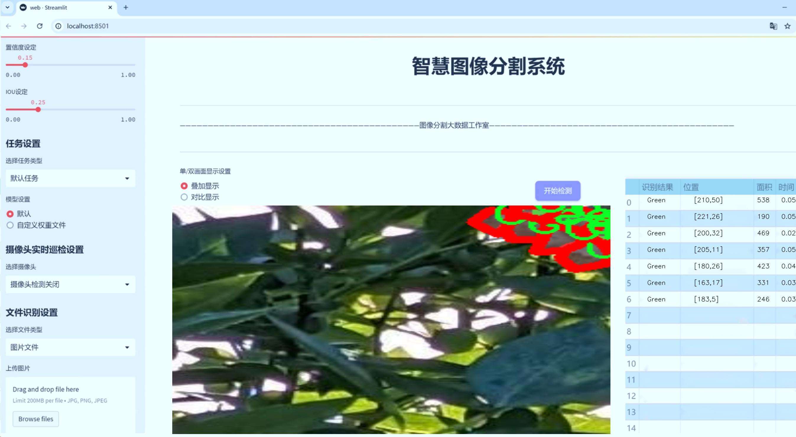
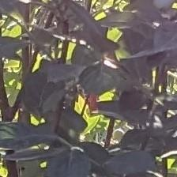
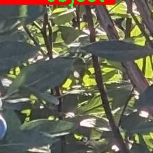
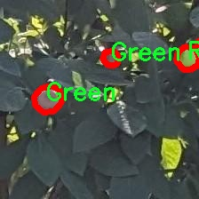
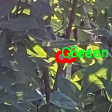

# 水果成熟度分割系统源码＆数据集分享
 [yolov8-seg-LAWDS＆yolov8-seg-C2f-DCNV2等50+全套改进创新点发刊_一键训练教程_Web前端展示]

### 1.研究背景与意义

项目参考[ILSVRC ImageNet Large Scale Visual Recognition Challenge](https://gitee.com/YOLOv8_YOLOv11_Segmentation_Studio/projects)

项目来源[AAAI Global Al lnnovation Contest](https://kdocs.cn/l/cszuIiCKVNis)

研究背景与意义

随着全球人口的不断增长和城市化进程的加快，食品安全和农业生产效率已成为当今社会亟待解决的重要问题。水果作为人们日常饮食中不可或缺的组成部分，其成熟度的准确判断直接影响到水果的市场价值和消费者的购买体验。传统的水果成熟度判断方法主要依赖于人工观察和经验判断，这不仅效率低下，而且容易受到主观因素的影响，导致判断结果的不一致性。因此，开发一种高效、准确的水果成熟度分割系统显得尤为重要。

近年来，深度学习技术的迅猛发展为图像处理和计算机视觉领域带来了革命性的变化。尤其是YOLO（You Only Look Once）系列模型的出现，使得目标检测和分割任务的实时性和准确性得到了显著提升。YOLOv8作为该系列的最新版本，结合了多种先进的技术和算法，具有更高的检测精度和更快的处理速度。通过对YOLOv8的改进，能够进一步提升其在水果成熟度分割任务中的表现，为水果的自动化检测提供新的解决方案。

本研究旨在基于改进的YOLOv8模型，构建一个水果成熟度分割系统。该系统将利用Kidda数据集中的2000张图像进行训练和测试，数据集中包含四个成熟度类别：绿色、半熟、成熟和物体。这一多样化的类别设置为模型的训练提供了丰富的样本，能够有效提升模型对不同成熟度水果的识别能力。此外，数据集的实例分割特性使得模型不仅能够识别水果的类别，还能精确地分割出每个水果在图像中的位置，为后续的应用提供了更为细致的信息。

本研究的意义在于，首先，通过引入深度学习技术，尤其是改进的YOLOv8模型，能够实现水果成熟度的自动化、智能化检测，极大地提高了检测效率和准确性。其次，该系统的应用不仅可以为果农提供科学的采摘建议，帮助他们在最佳时机采摘水果，从而最大化水果的市场价值，还可以为消费者提供更高质量的水果选择，提升消费体验。此外，该研究还将为其他领域的图像分割任务提供借鉴，推动计算机视觉技术在农业及食品安全领域的广泛应用。

综上所述，基于改进YOLOv8的水果成熟度分割系统的研究，不仅具有重要的理论价值，还具备广泛的实际应用前景。通过这一研究，期望能够为农业生产的智能化转型贡献力量，促进可持续发展目标的实现。

### 2.图片演示







##### 注意：由于此博客编辑较早，上面“2.图片演示”和“3.视频演示”展示的系统图片或者视频可能为老版本，新版本在老版本的基础上升级如下：（实际效果以升级的新版本为准）

  （1）适配了YOLOV8的“目标检测”模型和“实例分割”模型，通过加载相应的权重（.pt）文件即可自适应加载模型。

  （2）支持“图片识别”、“视频识别”、“摄像头实时识别”三种识别模式。

  （3）支持“图片识别”、“视频识别”、“摄像头实时识别”三种识别结果保存导出，解决手动导出（容易卡顿出现爆内存）存在的问题，识别完自动保存结果并导出到tempDir中。

  （4）支持Web前端系统中的标题、背景图等自定义修改，后面提供修改教程。

  另外本项目提供训练的数据集和训练教程,暂不提供权重文件（best.pt）,需要您按照教程进行训练后实现图片演示和Web前端界面演示的效果。

### 3.视频演示

[3.1 视频演示](https://www.bilibili.com/video/BV1bsy3YaEKj/)

### 4.数据集信息展示

##### 4.1 本项目数据集详细数据（类别数＆类别名）

nc: 4
names: ['Green', 'Half', 'Ripe', 'object']


##### 4.2 本项目数据集信息介绍

数据集信息展示

在本研究中，我们采用了名为“Kidda”的数据集，以训练和改进YOLOv8-seg模型，旨在实现水果成熟度的精确分割。该数据集专注于水果的不同成熟阶段，提供了丰富的图像数据，涵盖了四个主要类别：Green（青果）、Half（半熟）、Ripe（成熟）和object（物体）。这些类别不仅代表了水果在生长过程中的不同成熟状态，还为模型的训练提供了多样化的样本，确保了模型在实际应用中的泛化能力。

“Kidda”数据集的构建经过精心设计，旨在捕捉水果在不同光照、角度和背景下的特征。每个类别的图像均经过标注，确保了数据的准确性和可靠性。青果（Green）类别包含那些尚未成熟的水果图像，通常呈现出鲜艳的绿色，且表面光滑，缺乏成熟水果的特征。半熟（Half）类别则展示了那些已经开始变色的水果，通常呈现出黄色或橙色的过渡状态，表明其即将成熟。成熟（Ripe）类别的图像则展示了色泽鲜艳、外观饱满的水果，通常是消费者所追求的理想状态。最后，object类别则包括其他与水果相关的物体，可能是背景中的杂物或其他干扰元素，这为模型的鲁棒性提供了挑战。

在数据集的构建过程中，研究团队注重了数据的多样性和代表性，确保每个类别的样本数量相对均衡，以避免模型在训练过程中出现偏倚。此外，数据集还考虑了不同品种水果的多样性，涵盖了多种常见水果，如苹果、香蕉、橙子等，进一步增强了模型的适应性。通过这种方式，模型不仅能够识别不同成熟度的水果，还能适应不同品种的特征，从而提高其在实际应用中的实用性。

为了提升模型的性能，数据集还包括了一系列数据增强技术，如旋转、缩放、翻转和颜色调整等。这些技术的应用不仅增加了训练样本的数量，还帮助模型学习到更为丰富的特征表示，从而提高其对不同环境和条件下水果成熟度的识别能力。

在训练过程中，研究团队将“Kidda”数据集与YOLOv8-seg模型相结合，利用其强大的特征提取和分割能力，旨在实现高精度的水果成熟度分割。通过对数据集的深入分析和处理，模型能够在复杂的场景中有效识别出不同成熟度的水果，为农业生产和市场销售提供科学依据。

总之，“Kidda”数据集为水果成熟度分割系统的研究提供了坚实的基础，其丰富的类别和多样化的样本将极大地推动YOLOv8-seg模型的改进与应用。通过对这一数据集的深入挖掘与分析，我们期待能够实现更高效、更准确的水果成熟度识别，为智能农业的发展贡献力量。










### 5.全套项目环境部署视频教程（零基础手把手教学）

[5.1 环境部署教程链接（零基础手把手教学）](https://www.bilibili.com/video/BV1jG4Ve4E9t/?vd_source=bc9aec86d164b67a7004b996143742dc)


[5.2 安装Python虚拟环境创建和依赖库安装视频教程链接（零基础手把手教学）](https://www.bilibili.com/video/BV1nA4VeYEze/?vd_source=bc9aec86d164b67a7004b996143742dc)

### 6.手把手YOLOV8-seg训练视频教程（零基础小白有手就能学会）

[6.1 手把手YOLOV8-seg训练视频教程（零基础小白有手就能学会）](https://www.bilibili.com/video/BV1cA4VeYETe/?vd_source=bc9aec86d164b67a7004b996143742dc)


按照上面的训练视频教程链接加载项目提供的数据集，运行train.py即可开始训练



     Epoch   gpu_mem       box       obj       cls    labels  img_size
     1/200     0G   0.01576   0.01955  0.007536        22      1280: 100%|██████████| 849/849 [14:42<00:00,  1.04s/it]
               Class     Images     Labels          P          R     mAP@.5 mAP@.5:.95: 100%|██████████| 213/213 [01:14<00:00,  2.87it/s]
                 all       3395      17314      0.994      0.957      0.0957      0.0843

     Epoch   gpu_mem       box       obj       cls    labels  img_size
     2/200     0G   0.01578   0.01923  0.007006        22      1280: 100%|██████████| 849/849 [14:44<00:00,  1.04s/it]
               Class     Images     Labels          P          R     mAP@.5 mAP@.5:.95: 100%|██████████| 213/213 [01:12<00:00,  2.95it/s]
                 all       3395      17314      0.996      0.956      0.0957      0.0845

     Epoch   gpu_mem       box       obj       cls    labels  img_size
     3/200     0G   0.01561    0.0191  0.006895        27      1280: 100%|██████████| 849/849 [10:56<00:00,  1.29it/s]
               Class     Images     Labels          P          R     mAP@.5 mAP@.5:.95: 100%|███████   | 187/213 [00:52<00:00,  4.04it/s]
                 all       3395      17314      0.996      0.957      0.0957      0.0845


### 7.50+种全套YOLOV8-seg创新点代码加载调参视频教程（一键加载写好的改进模型的配置文件）

[7.1 50+种全套YOLOV8-seg创新点代码加载调参视频教程（一键加载写好的改进模型的配置文件）](https://www.bilibili.com/video/BV1Hw4VePEXv/?vd_source=bc9aec86d164b67a7004b996143742dc)

### 8.YOLOV8-seg图像分割算法原理

原始YOLOV8-seg算法原理

YOLOv8-seg算法是Ultralytics在2023年1月推出的一项重要技术进展，基于YOLO系列模型的成功经验，尤其是YOLOv5及其后续版本，YOLOv8-seg不仅继承了前者的优点，还通过引入一系列创新的设计理念和技术手段，进一步提升了目标检测和分割的性能。YOLOv8-seg的核心在于其高效的网络结构和优化的训练策略，使其在实时检测和精确分割任务中表现出色。

首先，YOLOv8-seg的网络结构经过了精心设计，以适应不同尺寸和复杂度的输入图像。该模型采用了C2f模块替代了传统的C3模块，C2f模块的设计灵感来源于YOLOv7中的ELAN结构，强调了跳层连接的使用。这种结构的优势在于它能够有效地增强梯度流，促进信息的高效传递，从而提高模型的学习能力和准确性。此外，YOLOv8-seg在主干网络中保留了SPPF（Spatial Pyramid Pooling Fast）模块，这一设计不仅确保了特征提取的丰富性，同时也优化了计算效率，降低了模型的执行时间。

在颈部网络部分，YOLOv8-seg同样采用了C2f模块，进一步提升了特征融合的能力。与传统的卷积层相比，C2f模块通过更为灵活的连接方式，能够更好地捕捉到不同尺度的特征信息。这一特性对于目标检测和分割任务尤为重要，因为在复杂场景中，目标的尺度和形状各异，只有通过有效的特征融合，才能实现高精度的检测和分割。

YOLOv8-seg的头部网络则引入了YOLOX中的解耦头设计，分为两个并行的分支，分别负责类别和位置特征的提取。这种解耦设计使得模型在处理分类和定位任务时能够更具针对性，从而加快收敛速度，提高预测精度。分类任务更注重特征图中与已有类别的相似性，而定位任务则关注边界框与真实框之间的关系，这种分工明确的设计使得YOLOv8-seg在复杂场景下的表现更加优异。

在损失函数的设计上，YOLOv8-seg引入了任务对齐学习（Task Alignment Learning，TAL）的概念，通过对分类分数和IOU（Intersection over Union）的高次幂乘积进行优化，确保了分类和定位任务的协同提升。这一创新使得模型在训练过程中能够更好地平衡分类和定位的精度，最终实现更高的mAP（mean Average Precision）值。

YOLOv8-seg在实际应用中展现出了极高的灵活性和适应性，尤其是在苹果采摘等农业场景中，利用其强大的视觉识别能力，能够自动检测和定位目标物体。通过与蚁群算法结合，YOLOv8-seg不仅能够实现高效的目标检测，还能为自动采摘机器人提供优化的路径规划，确保采摘过程的高效性和准确性。

在训练过程中，YOLOv8-seg对数据增强策略进行了优化，特别是在训练的最后阶段停止使用Mosaic数据增强，以避免对数据真实分布的破坏。这一策略的实施，使得模型在训练后期能够更好地学习到真实场景中的特征，从而提升了模型的泛化能力和鲁棒性。

总的来说，YOLOv8-seg算法通过一系列创新的设计和优化，不仅在目标检测和分割任务中达到了新的高度，也为实时应用提供了强有力的支持。其高精度和快速推理的特性，使得YOLOv8-seg在智能监控、自动驾驶、农业自动化等多个领域展现出广泛的应用前景。随着YOLOv8-seg的不断发展和完善，未来有望在更多复杂场景中发挥更大的作用，为各行各业的智能化转型提供强有力的技术支持。


### 9.系统功能展示（检测对象为举例，实际内容以本项目数据集为准）

图9.1.系统支持检测结果表格显示

  图9.2.系统支持置信度和IOU阈值手动调节

  图9.3.系统支持自定义加载权重文件best.pt(需要你通过步骤5中训练获得)

  图9.4.系统支持摄像头实时识别

  图9.5.系统支持图片识别

  图9.6.系统支持视频识别

  图9.7.系统支持识别结果文件自动保存

  图9.8.系统支持Excel导出检测结果数据


### 10.50+种全套YOLOV8-seg创新点原理讲解（非科班也可以轻松写刊发刊，V11版本正在科研待更新）

#### 10.1 由于篇幅限制，每个创新点的具体原理讲解就不一一展开，具体见下列网址中的创新点对应子项目的技术原理博客网址【Blog】：


[10.1 50+种全套YOLOV8-seg创新点原理讲解链接](https://gitee.com/qunmasj/good)

#### 10.2 部分改进模块原理讲解(完整的改进原理见上图和技术博客链接)【如果此小节的图加载失败可以通过CSDN或者Github搜索该博客的标题访问原始博客，原始博客图片显示正常】
### YOLOv8简介

YOLOv8是一种最新的SOTA算法，提供了N/S/M/L/X尺度的不同大小模型，以满足不同场景的需求。本章对算法网络的新特性进行简要介绍。


1）骨干网络和Neck
开发者设计了C2f模块对CSPDarkNet 53和PAFPN进行改造。相比C3模块，C2f模块拥有更多的分支跨层链接，使模型的梯度流更加丰富，显著增强了模型的特征提取能力。
2)Head部分
Head部分采用无锚框设计，将分类任务和回归任务进行了解耦，独立的分支将更加专注于其所负责的特征信息。
3）损失计算
模型使用CIOU Loss作为误差损失函数，并通过最小化DFL进一步提升边界框的回归精度。同时模型采用了TaskAlignedAssigner样本分配策略，以分类得分和IOU的高阶组合作为指标指导正负样本选择，实现了高分类得分和高IOU的对齐，有效地提升了模型的检测精度。


### D-LKA Attention简介
自2010年代中期以来，卷积神经网络（CNNs）已成为许多计算机视觉应用的首选技术。它们能够从原始数据中自动提取复杂的特征表示，无需手动进行特征工程，这引起了医学图像分析社区的极大兴趣。许多成功的CNN架构，如U-Net、全卷积网络、DeepLab或SegCaps（分割胶囊），已经被开发出来。这些架构在语义分割任务中取得了巨大成功，先前的最新方法已经被超越。

在计算机视觉研究中，不同尺度下的目标识别是一个关键问题。在CNN中，可检测目标的大小与相应网络层的感受野尺寸密切相关。如果一个目标扩展到超出这个感受野的边界，这可能会导致欠分割结果。相反，与目标实际大小相比使用过大的感受野可能会限制识别，因为背景信息可能会对预测产生不必要的影响。

解决这个问题的一个有希望的方法涉及在并行使用具有不同尺寸的多个Kernel，类似于Inception块的机制。然而，由于参数和计算要求的指数增长，将Kernel大小增加以容纳更大的目标在实践中受到限制。因此，出现了各种策略，包括金字塔池化技术和不同尺度的扩张卷积，以捕获多尺度的上下文信息。

另一个直观的概念涉及将多尺度图像金字塔或它们的相关特征表示直接纳入网络架构。然而，这种方法存在挑战，特别是在管理训练和推理时间方面的可行性方面存在挑战。在这个背景下，使用编码器-解码器网络，如U-Net，已被证明是有利的。这样的网络在较浅的层中编码外观和位置，而在更深的层中，通过神经元的更广泛的感受野捕获更高的语义信息和上下文信息。

一些方法将来自不同层的特征组合在一起，或者预测来自不同尺寸的层的特征以使用多尺度的信息。此外，出现了从不同尺度的层中预测特征的方法，有效地实现了跨多个尺度的见解整合。然而，大多数编码器-解码器结构面临一个挑战：它们经常无法在不同尺度之间保持一致的特征，并主要使用最后一个解码器层生成分割结果。

语义分割是一项任务，涉及根据预定义的标签集为图像中的每个像素预测语义类别。这项任务要求提取高级特征同时保留初始的空间分辨率。CNNs非常适合捕获局部细节和低级信息，尽管以忽略全局上下文为代价。视觉Transformer（ViT）架构已经成为解决处理全局信息的视觉任务的关键，包括语义分割，取得了显著的成功。

ViT的基础是注意力机制，它有助于在整个输入序列上聚合信息。这种能力使网络能够合并远程的上下文提示，超越了CNN的有限感受野尺寸。然而，这种策略通常会限制ViT有效建模局部信息的能力。这种局限可能会妨碍它们检测局部纹理的能力，这对于各种诊断和预测任务至关重要。这种缺乏局部表示可以归因于ViT模型处理图像的特定方式。

ViT模型将图像分成一系列Patch，并使用自注意力机制来模拟它们之间的依赖关系。这种方法可能不如CNN模型中的卷积操作对感受野内提取局部特征有效。ViT和CNN模型之间的这种图像处理方法的差异可能解释了CNN模型在局部特征提取方面表现出色的原因。

近年来，已经开发出创新性方法来解决Transformer模型内部局部纹理不足的问题。其中一种方法是通过互补方法将CNN和ViT特征结合起来，以结合它们的优势并减轻局部表示的不足。TransUNet是这种方法的早期示例，它在CNN的瓶颈中集成了Transformer层，以模拟局部和全局依赖关系。HiFormer提出了一种解决方案，将Swin Transformer模块和基于CNN的编码器结合起来，生成两个多尺度特征表示，通过Double-Level Fusion模块集成。UNETR使用基于Transformer的编码器和CNN解码器进行3D医学图像分割。CoTr和TransBTS通过Transformer在低分辨率阶段增强分割性能，将CNN编码器和解码器连接在一起。

增强局部特征表示的另一种策略是重新设计纯Transformer模型内部的自注意力机制。在这方面，Swin-Unet在U形结构中集成了一个具有线性计算复杂性的Swin Transformer块作为多尺度 Backbone 。MISSFormer采用高效Transformer来解决视觉Transformer中的参数问题，通过在输入块上进行不可逆的降采样操作。D-Former引入了一个纯Transformer的管道，具有双重注意模块，以分段的方式捕获细粒度的局部注意和与多元单元的交互。然而，仍然存在一些特定的限制，包括计算效率低下，如TransUNet模型所示，对CNN Backbone 的严重依赖，如HiFormer所观察到的，以及对多尺度信息的忽略。

此外，目前的分割架构通常采用逐层处理3D输入 volumetric 的方法，无意中忽视了相邻切片之间的潜在相关性。这一疏忽限制了对 volumetric 信息的全面利用，因此损害了定位精度和上下文集成。此外，必须认识到，医学领域的病变通常在形状上发生变形。因此，用于医学图像分析的任何学习算法都必须具备捕捉和理解这些变形的能力。与此同时，该算法应保持计算效率，以便处理3D volumetric数据。

为了解决上述提到的挑战，作者提出了一个解决方案，即可变形大卷积核注意力模块（Deformable LKA module），它是作者网络设计的基本构建模块。这个模块明确设计成在有效处理上下文信息的同时保留局部描述符。作者的架构在这两个方面的平衡增强了实现精确语义分割的能力。

值得注意的是，参考该博客引入了一种基于数据的感受野的动态适应，不同于传统卷积操作中的固定滤波器Mask。这种自适应方法使作者能够克服与静态方法相关的固有限制。这种创新方法还扩展到了D-LKA Net架构的2D和3D版本的开发。

在3D模型的情况下，D-LKA机制被量身定制以适应3D环境，从而实现在不同 volumetric 切片之间无缝信息交互。最后，作者的贡献通过其计算效率得到进一步强调。作者通过仅依靠D-LKA概念的设计来实现这一点，在各种分割基准上取得了显著的性能，确立了作者的方法作为一种新的SOTA方法。

在本节中，作者首先概述方法论。首先，作者回顾了由Guo等人引入的大卷积核注意力（Large Kernel Attention，LKA）的概念。然后，作者介绍了作者对可变形LKA模块的创新探索。在此基础上，作者介绍了用于分割任务的2D和3D网络架构。

大卷积核提供了与自注意力机制类似的感受野。可以通过使用深度卷积、深度可扩展卷积和卷积来构建大卷积核，从而减少了参数和计算量。构建输入维度为和通道数的卷积核的深度卷积和深度可扩展卷积的卷积核大小的方程如下：


具有卷积核大小和膨胀率。参数数量和浮点运算（FLOPs）的计算如下：


FLOPs的数量与输入图像的大小成线性增长。参数的数量随通道数和卷积核大小的增加而呈二次增长。然而，由于它们通常都很小，因此它们不是限制因素。

为了最小化对于固定卷积核大小K的参数数量，可以将方程3对于膨胀率的导数设定为零：


例如，当卷积核大小为时，结果是。将这些公式扩展到3D情况是直接的。对于大小为和通道数C的输入，3D情况下参数数量和FLOPs 的方程如下：


具有卷积核大小和膨胀。


利用大卷积核进行医学图像分割的概念通过引入可变形卷积得以扩展。可变形卷积可以通过整数偏移自由调整采样网格以进行自由变形。额外的卷积层从特征图中学习出变形，从而创建一个偏移场。基于特征本身学习变形会导致自适应卷积核。这种灵活的卷积核形状可以提高病变或器官变形的表示，从而增强了目标边界的定义。

负责计算偏移的卷积层遵循其相应卷积层的卷积核大小和膨胀。双线性插值用于计算不在图像网格上的偏移的像素值。如图2所示，D-LKA模块可以表示为：


其中输入特征由表示，。表示为注意力图，其中每个值表示相应特征的相对重要性。运算符  表示逐元素乘法运算。值得注意的是，LKA不同于传统的注意力方法，它不需要额外的规范化函数，如或。这些规范化函数往往忽视高频信息，从而降低了基于自注意力的方法的性能。

在该方法的2D版本中，卷积层被可变形卷积所替代，因为可变形卷积能够改善对具有不规则形状和大小的目标的捕捉能力。这些目标在医学图像数据中常常出现，因此这种增强尤为重要。

然而，将可变形LKA的概念扩展到3D领域会带来一定的挑战。主要的约束来自于需要用于生成偏移的额外卷积层。与2D情况不同，由于输入和输出通道的性质，这一层无法以深度可分的方式执行。在3D环境中，输入通道对应于特征，而输出通道扩展到，其中是卷积核的大小。大卷积核的复杂性导致沿第3D的通道数扩展，导致参数和FLOPs大幅增加。因此，针对3D情况采用了另一种替代方法。在现有的LKA框架中，深度卷积之后引入了一个单独的可变形卷积层。这种战略性的设计调整旨在减轻扩展到3D领域所带来的挑战。


2D网络的架构如图1所示。第一变种使用MaxViT作为编码器组件，用于高效特征提取，而第二变种则结合可变形LKA层进行更精细、卓越的分割。

在更正式的描述中，编码器生成4个分层输出表示。首先，卷积干扰将输入图像的维度减小到。随后，通过4个MaxViT块的4个阶段进行特征提取，每个阶段后跟随降采样层。随着过程进展到解码器，实施了4个阶段的D-LKA层，每个阶段包含2个D-LKA块。然后，应用Patch扩展层以实现分辨率上采样，同时减小通道维度。最后，线性层负责生成最终的输出。

2D D-LKA块的结构包括LayerNorm、可变形LKA和多层感知器（MLP）。积分残差连接确保了有效的特征传播，即使在更深层也是如此。这个安排可以用数学方式表示为：


其中输入特征，层归一化LN，可变形LKA注意力，深度卷积，线性层和GeLU激活函数。

3D网络架构如图1所示，采用编码器-解码器设计进行分层结构化。首先，一个Patch嵌入层将输入图像的维度从（）减小到（）。在编码器中，采用了3个D-LKA阶段的序列，每个阶段包含3个D-LKA块。在每个阶段之后，通过降采样步骤将空间分辨率减半，同时将通道维度加倍。中央瓶颈包括另一组2个D-LKA块。解码器结构与编码器相对称。

为了将特征分辨率加倍，同时减少通道数，使用转置卷积。每个解码器阶段都使用3个D-LKA块来促进远距离特征依赖性。最终的分割输出由一个卷积层产生，后面跟随一个卷积层以匹配特定类别的通道要求。

为了建立输入图像和分割输出之间的直接连接，使用卷积形成了一个跳跃连接。额外的跳跃连接根据简单的加法对来自其他阶段的特征进行融合。最终的分割图是通过和卷积层的组合产生的。

3D D-LKA块包括层归一化，后跟D-LKA注意力，应用了残差连接的部分。随后的部分采用了一个卷积层，后面跟随一个卷积层，两者都伴随着残差连接。这个整个过程可以总结如下：


带有输入特征 、层归一化 、可变形 LKA 、卷积层 和输出特征 的公式。是指一个前馈网络，包括2个卷积层和激活函数。

表7显示了普通卷积和构建卷积的参数数量比较。尽管标准卷积的参数数量在通道数较多时急剧增加，但分解卷积的参数总体较低，并且增长速度不那么快。

与分解卷积相比，可变形分解卷积增加了大量参数，但仍然明显小于标准卷积。可变形卷积的主要参数是由偏移网络创建的。在这里，作者假设可变形深度卷积的Kernel大小为（5,5），可变形深度空洞卷积的Kernel大小为（7,7）。这导致了21×21大小的大Kernel的最佳参数数量。更高效地生成偏移量的方法将大大减少参数数量。


值得注意的是，引入可变形LKA确实会增加模型的参数数量和每秒的浮点运算次数（FLOPS）。然而，重要的是强调，这增加的计算负载不会影响作者模型的整体推理速度。

相反，对于Batch-size > 1，作者甚至观察到推理时间的减少，如图7所示。例如，基于作者的广泛实验，作者观察到对于Batch-size为16，具有可变形卷积和没有可变形卷积的推理时间分别为8.01毫秒和17.38毫秒。作者认为这是由于在2D中对可变形卷积的高效实现所致。为了测量时间，使用了大小为（）的随机输入。在GPU热身周期50次迭代之后，网络被推断了1000次。测量是在NVIDIA RTX 3090 GPU上进行的。


为了充分利用性能与参数之间的权衡关系，作者在图8中可视化了在Synapse 2D数据集上报告的DSC和HD性能以及基于参数数量的内存消耗。D-LKA Net引入了相当多的参数，约为101M。这比性能第二好的方法ScaleFormer使用的111.6M参数要少。

与更轻量级的DAEFormer模型相比，作者实现了更好的性能，这证明了参数增加的合理性。大多数参数来自于MaxViT编码器；因此，将编码器替换为更高效的编码器可以减少模型参数。值得注意的是，在此可视化中，作者最初将HD和内存值都归一化到[0, 100]范围内。随后，作者将它们从100缩小，以增强更高值的表示。


### 11.项目核心源码讲解（再也不用担心看不懂代码逻辑）

#### 11.1 ultralytics\__init__.py

以下是代码的核心部分，并附上详细的中文注释：

```python
# Ultralytics YOLO 🚀, AGPL-3.0 license

# 定义当前版本号
__version__ = '8.0.202'

# 从ultralytics.models模块导入多个模型类
from ultralytics.models import RTDETR, SAM, YOLO
from ultralytics.models.fastsam import FastSAM
from ultralytics.models.nas import NAS

# 从ultralytics.utils模块导入设置、检查和下载工具
from ultralytics.utils import SETTINGS as settings
from ultralytics.utils.checks import check_yolo as checks
from ultralytics.utils.downloads import download

# 定义模块的公开接口，包含版本号和导入的类与函数
__all__ = '__version__', 'YOLO', 'NAS', 'SAM', 'FastSAM', 'RTDETR', 'checks', 'download', 'settings'
```

### 代码注释说明：

1. **版本号定义**：
   - `__version__ = '8.0.202'`：定义了当前模块的版本号，便于用户和开发者了解使用的版本。

2. **模型导入**：
   - `from ultralytics.models import RTDETR, SAM, YOLO`：从`ultralytics.models`模块中导入了三种模型，分别是RTDETR、SAM和YOLO。这些模型通常用于目标检测和分割任务。
   - `from ultralytics.models.fastsam import FastSAM`：导入FastSAM模型，可能是针对快速分割任务的优化版本。
   - `from ultralytics.models.nas import NAS`：导入NAS模型，可能是用于神经架构搜索的模型。

3. **工具导入**：
   - `from ultralytics.utils import SETTINGS as settings`：导入设置工具，通常用于配置模型或训练参数。
   - `from ultralytics.utils.checks import check_yolo as checks`：导入YOLO检查工具，可能用于验证YOLO模型的有效性或配置。
   - `from ultralytics.utils.downloads import download`：导入下载工具，通常用于下载模型权重或数据集。

4. **公开接口定义**：
   - `__all__ = ...`：定义了模块的公开接口，包含了版本号和导入的类与函数，方便用户在使用`from module import *`时了解可用的内容。

这个文件是Ultralytics YOLO库的初始化文件，主要用于定义库的版本和导入必要的模块与功能。首先，文件中定义了库的版本号为'8.0.202'，这有助于用户和开发者了解当前使用的库版本。

接下来，文件从`ultralytics.models`模块中导入了多个模型，包括RTDETR、SAM和YOLO。这些模型是Ultralytics库的核心部分，分别用于不同的计算机视觉任务，如目标检测和分割等。此外，还从`ultralytics.models.fastsam`中导入了FastSAM模型，这可能是一个优化过的版本，用于提高处理速度。

文件还导入了`ultralytics.models.nas`中的NAS模块，NAS通常指神经架构搜索，可能用于自动化模型架构的设计和优化。

在工具方面，文件从`ultralytics.utils`模块中导入了SETTINGS、check_yolo和download等功能。SETTINGS可能包含一些配置参数，check_yolo用于检查YOLO模型的有效性或完整性，而download则可能用于下载所需的模型或数据。

最后，`__all__`变量定义了当使用`from ultralytics import *`时，哪些模块和功能会被导入。这个列表包括版本号、各个模型以及一些工具函数，确保用户可以方便地访问这些重要的功能。

总体而言，这个初始化文件的主要作用是组织和暴露Ultralytics库的核心功能，使得用户能够方便地使用和调用这些功能。

#### 11.2 ui.py

```python
import sys
import subprocess

def run_script(script_path):
    """
    使用当前 Python 环境运行指定的脚本。

    Args:
        script_path (str): 要运行的脚本路径

    Returns:
        None
    """
    # 获取当前 Python 解释器的路径
    python_path = sys.executable

    # 构建运行命令，使用 streamlit 运行指定的脚本
    command = f'"{python_path}" -m streamlit run "{script_path}"'

    # 执行命令并等待其完成
    result = subprocess.run(command, shell=True)
    
    # 检查命令执行的返回码，如果不为0则表示出错
    if result.returncode != 0:
        print("脚本运行出错。")


# 实例化并运行应用
if __name__ == "__main__":
    # 指定要运行的脚本路径
    script_path = "web.py"  # 假设脚本在当前目录下

    # 调用函数运行脚本
    run_script(script_path)
```

### 代码核心部分及注释说明：

1. **导入模块**：
   - `import sys`: 导入 sys 模块，用于获取当前 Python 解释器的路径。
   - `import subprocess`: 导入 subprocess 模块，用于执行外部命令。

2. **定义 `run_script` 函数**：
   - 函数接受一个参数 `script_path`，表示要运行的 Python 脚本的路径。
   - 使用 `sys.executable` 获取当前 Python 解释器的路径，以便在正确的环境中运行脚本。
   - 构建命令字符串，使用 `streamlit` 模块运行指定的脚本。
   - 使用 `subprocess.run` 执行构建的命令，并等待其完成。
   - 检查命令的返回码，如果返回码不为0，表示脚本运行出错，打印错误信息。

3. **主程序入口**：
   - 使用 `if __name__ == "__main__":` 确保代码仅在直接运行时执行。
   - 指定要运行的脚本路径（假设脚本名为 `web.py`）。
   - 调用 `run_script` 函数，传入脚本路径以执行。

这个程序文件名为 `ui.py`，主要功能是使用当前的 Python 环境来运行一个指定的脚本，具体是通过 Streamlit 来启动一个 Web 应用。

程序首先导入了必要的模块，包括 `sys`、`os` 和 `subprocess`，这些模块分别用于获取系统信息、处理文件路径和执行外部命令。此外，还从 `QtFusion.path` 导入了 `abs_path` 函数，用于获取脚本的绝对路径。

在 `run_script` 函数中，首先获取当前 Python 解释器的路径，这通过 `sys.executable` 实现。接着，构建一个命令字符串，该命令使用 Streamlit 来运行指定的脚本。命令的格式是 `"{python_path}" -m streamlit run "{script_path}"`，其中 `python_path` 是当前 Python 解释器的路径，`script_path` 是要运行的脚本路径。

然后，使用 `subprocess.run` 方法执行这个命令。`shell=True` 参数允许在 shell 中执行命令。执行完命令后，程序检查返回码，如果返回码不为 0，表示脚本运行出错，此时会打印出“脚本运行出错。”的提示信息。

在文件的最后部分，使用 `if __name__ == "__main__":` 语句来确保当该文件作为主程序运行时才会执行后面的代码。在这里，指定了要运行的脚本路径为 `web.py`，并调用 `abs_path` 函数获取其绝对路径。最后，调用 `run_script` 函数来执行这个脚本。

总的来说，这个程序的核心功能是方便地通过当前 Python 环境运行一个 Streamlit 应用，提供了一种简单的方式来启动 Web 应用。

#### 11.3 ultralytics\utils\triton.py

以下是经过简化和注释的核心代码部分：

```python
# 导入必要的库
from typing import List
from urllib.parse import urlsplit
import numpy as np

class TritonRemoteModel:
    """
    与远程Triton推理服务器模型交互的客户端。

    属性:
        endpoint (str): Triton服务器上模型的名称。
        url (str): Triton服务器的URL。
        triton_client: Triton客户端（HTTP或gRPC）。
        InferInput: Triton客户端的输入类。
        InferRequestedOutput: Triton客户端的输出请求类。
        input_formats (List[str]): 模型输入的数据类型。
        np_input_formats (List[type]): 模型输入的numpy数据类型。
        input_names (List[str]): 模型输入的名称。
        output_names (List[str]): 模型输出的名称。
    """

    def __init__(self, url: str, endpoint: str = '', scheme: str = ''):
        """
        初始化TritonRemoteModel。

        参数可以单独提供，也可以从形式为<scheme>://<netloc>/<endpoint>/<task_name>的'url'参数中解析。

        参数:
            url (str): Triton服务器的URL。
            endpoint (str): Triton服务器上模型的名称。
            scheme (str): 通信方案（'http'或'gRPC'）。
        """
        # 如果没有提供endpoint和scheme，则从URL中解析
        if not endpoint and not scheme:
            splits = urlsplit(url)
            endpoint = splits.path.strip('/').split('/')[0]  # 获取模型名称
            scheme = splits.scheme  # 获取通信方案
            url = splits.netloc  # 获取服务器地址

        self.endpoint = endpoint  # 设置模型名称
        self.url = url  # 设置服务器URL

        # 根据通信方案选择Triton客户端
        if scheme == 'http':
            import tritonclient.http as client  # 导入HTTP客户端
            self.triton_client = client.InferenceServerClient(url=self.url, verbose=False, ssl=False)
            config = self.triton_client.get_model_config(endpoint)  # 获取模型配置
        else:
            import tritonclient.grpc as client  # 导入gRPC客户端
            self.triton_client = client.InferenceServerClient(url=self.url, verbose=False, ssl=False)
            config = self.triton_client.get_model_config(endpoint, as_json=True)['config']  # 获取模型配置

        # 按字母顺序排序输出名称
        config['output'] = sorted(config['output'], key=lambda x: x.get('name'))

        # 定义模型属性
        type_map = {'TYPE_FP32': np.float32, 'TYPE_FP16': np.float16, 'TYPE_UINT8': np.uint8}
        self.InferRequestedOutput = client.InferRequestedOutput  # 设置输出请求类
        self.InferInput = client.InferInput  # 设置输入类
        self.input_formats = [x['data_type'] for x in config['input']]  # 获取输入数据类型
        self.np_input_formats = [type_map[x] for x in self.input_formats]  # 获取numpy数据类型
        self.input_names = [x['name'] for x in config['input']]  # 获取输入名称
        self.output_names = [x['name'] for x in config['output']]  # 获取输出名称

    def __call__(self, *inputs: np.ndarray) -> List[np.ndarray]:
        """
        使用给定的输入调用模型。

        参数:
            *inputs (List[np.ndarray]): 输入数据。

        返回:
            List[np.ndarray]: 模型输出。
        """
        infer_inputs = []  # 存储输入数据
        input_format = inputs[0].dtype  # 获取输入数据类型
        for i, x in enumerate(inputs):
            # 如果输入数据类型与模型要求不匹配，则转换数据类型
            if x.dtype != self.np_input_formats[i]:
                x = x.astype(self.np_input_formats[i])
            # 创建InferInput对象并设置数据
            infer_input = self.InferInput(self.input_names[i], [*x.shape], self.input_formats[i].replace('TYPE_', ''))
            infer_input.set_data_from_numpy(x)
            infer_inputs.append(infer_input)  # 添加到输入列表

        # 创建输出请求
        infer_outputs = [self.InferRequestedOutput(output_name) for output_name in self.output_names]
        # 调用Triton客户端进行推理
        outputs = self.triton_client.infer(model_name=self.endpoint, inputs=infer_inputs, outputs=infer_outputs)

        # 返回输出数据
        return [outputs.as_numpy(output_name).astype(input_format) for output_name in self.output_names]
```

### 代码注释说明：
1. **类定义**：`TritonRemoteModel`类用于与Triton推理服务器进行交互，包含模型的基本信息和推理方法。
2. **初始化方法**：`__init__`方法负责解析输入的URL和模型信息，并根据通信协议选择合适的Triton客户端。
3. **模型配置**：获取模型的输入输出配置，并将其存储为类属性，以便后续使用。
4. **调用方法**：`__call__`方法允许用户直接调用模型进行推理，处理输入数据并返回输出结果。

这个程序文件定义了一个名为 `TritonRemoteModel` 的类，用于与远程的 Triton 推理服务器模型进行交互。该类的主要功能是通过 HTTP 或 gRPC 协议与 Triton 服务器进行通信，发送输入数据并接收模型的输出结果。

在类的初始化方法 `__init__` 中，用户可以通过 URL 字符串或单独的参数来设置 Triton 服务器的地址、模型的名称和通信协议。如果没有提供模型名称和协议，程序会从 URL 中解析这些信息。初始化过程中，程序会根据所选的通信协议导入相应的 Triton 客户端库，并获取模型的配置，包括输入和输出的名称及数据类型。

类中定义了几个重要的属性，包括模型的输入输出名称、数据类型等。输入格式和 NumPy 数据类型被存储在 `input_formats` 和 `np_input_formats` 列表中，方便后续处理。

类的 `__call__` 方法允许用户直接调用该类的实例，并传入一个或多个 NumPy 数组作为输入。该方法会检查输入数据的类型，并根据模型的要求进行必要的类型转换。然后，它会创建输入对象并将数据设置到这些对象中。接着，程序会创建输出请求对象，并调用 Triton 客户端的推理方法，发送输入数据并获取输出结果。最后，输出结果会被转换为 NumPy 数组并返回。

总体而言，这个类提供了一种简洁的方式来与 Triton 推理服务器进行交互，使得用户能够方便地发送数据并获取模型的推理结果。

#### 11.4 train.py

以下是经过简化并注释的核心代码部分：

```python
import os
import torch
import yaml
from ultralytics import YOLO  # 导入YOLO模型库

if __name__ == '__main__':  # 确保该模块被直接运行时才执行以下代码
    # 设置训练参数
    workers = 1  # 数据加载工作进程数
    batch = 8  # 每个批次的样本数量
    device = "0" if torch.cuda.is_available() else "cpu"  # 检查是否有可用的GPU

    # 获取数据集配置文件的绝对路径
    data_path = abs_path(f'datasets/data/data.yaml', path_type='current')

    # 读取YAML文件，保持原有顺序
    with open(data_path, 'r') as file:
        data = yaml.load(file, Loader=yaml.FullLoader)

    # 修改数据集中训练、验证和测试集的路径
    if 'train' in data and 'val' in data and 'test' in data:
        directory_path = os.path.dirname(data_path.replace(os.sep, '/'))  # 获取目录路径
        data['train'] = directory_path + '/train'  # 更新训练集路径
        data['val'] = directory_path + '/val'      # 更新验证集路径
        data['test'] = directory_path + '/test'    # 更新测试集路径

        # 将修改后的数据写回YAML文件
        with open(data_path, 'w') as file:
            yaml.safe_dump(data, file, sort_keys=False)

    # 加载YOLO模型及其权重
    model = YOLO(r"C:\codeseg\codenew\50+种YOLOv8算法改进源码大全和调试加载训练教程（非必要）\改进YOLOv8模型配置文件\yolov8-seg-C2f-Faster.yaml").load("./weights/yolov8s-seg.pt")

    # 开始训练模型
    results = model.train(
        data=data_path,  # 指定训练数据的配置文件路径
        device=device,    # 使用指定的设备进行训练
        workers=workers,  # 使用的工作进程数
        imgsz=640,        # 输入图像的大小
        epochs=100,       # 训练的轮数
        batch=batch,      # 每个批次的样本数量
    )
```

### 代码注释说明：
1. **导入必要的库**：导入了操作系统相关的库、PyTorch库、YAML解析库和YOLO模型库。
2. **设置训练参数**：定义了数据加载的工作进程数、批次大小和设备类型（GPU或CPU）。
3. **获取数据集配置文件路径**：使用`abs_path`函数获取数据集的YAML配置文件的绝对路径。
4. **读取和修改YAML文件**：读取YAML文件内容，更新训练、验证和测试集的路径，并将修改后的内容写回文件。
5. **加载YOLO模型**：指定模型配置文件和权重文件，加载YOLO模型。
6. **开始训练模型**：调用`train`方法开始训练，传入数据路径、设备、工作进程数、图像大小、训练轮数和批次大小等参数。

这个程序文件 `train.py` 是一个用于训练 YOLO（You Only Look Once）模型的脚本，主要功能是设置训练参数、加载数据集、配置模型并开始训练。以下是对代码的逐行解释。

首先，程序导入了一些必要的库，包括 `os`、`torch`、`yaml` 和 `ultralytics` 中的 YOLO 模型。`matplotlib` 被设置为使用 `TkAgg` 后端，这通常用于绘图，但在这个脚本中并没有直接使用到。

在 `if __name__ == '__main__':` 语句下，确保该模块被直接运行时才执行以下代码。接下来，设置了一些训练参数。`workers` 设置为 1，表示使用一个工作进程来加载数据；`batch` 设置为 8，表示每个批次处理 8 张图像。`device` 根据是否有可用的 GPU 来选择设备，如果有 GPU 则使用 "0"（表示第一个 GPU），否则使用 "cpu"。

然后，程序通过 `abs_path` 函数获取数据集配置文件 `data.yaml` 的绝对路径，并将路径中的分隔符统一为 Unix 风格。接着，使用 `os.path.dirname` 获取该路径的目录部分。

程序打开 `data.yaml` 文件并读取内容，使用 `yaml.load` 解析 YAML 文件。接下来，检查 YAML 文件中是否包含 'train'、'val' 和 'test' 项，如果存在，则将这些项的路径修改为相对于目录的路径，并将修改后的数据写回 YAML 文件，确保路径的正确性。

在模型加载部分，程序使用 YOLO 模型的配置文件 `yolov8-seg-C2f-Faster.yaml`，并加载预训练的权重文件 `yolov8s-seg.pt`。这里有一段注释提醒用户，不同的模型对设备的要求不同，如果出现错误，可以尝试其他模型配置文件。

最后，程序调用 `model.train` 方法开始训练模型，传入训练数据的配置文件路径、设备、工作进程数量、输入图像大小（640x640）、训练的 epoch 数量（100）以及批次大小（8）。这样，模型将根据指定的参数进行训练。

总体来说，这个脚本是一个完整的训练流程，涵盖了数据准备、模型配置和训练过程，适合用于深度学习任务中的目标检测或图像分割。

#### 11.5 model.py

以下是经过简化和注释的核心代码部分：

```python
# -*- coding: utf-8 -*-
import cv2  # 导入OpenCV库，用于图像和视频处理
import torch  # 导入PyTorch库，用于深度学习
from ultralytics import YOLO  # 导入YOLO类，用于加载YOLO模型
from ultralytics.utils.torch_utils import select_device  # 导入设备选择函数

# 选择计算设备，如果有CUDA可用则使用GPU，否则使用CPU
device = "cuda:0" if torch.cuda.is_available() else "cpu"

# 初始化参数字典
ini_params = {
    'device': device,  # 设备类型
    'conf': 0.3,  # 物体置信度阈值
    'iou': 0.05,  # 非极大值抑制的IOU阈值
    'classes': None,  # 类别过滤器
    'verbose': False  # 是否详细输出
}

class Web_Detector:  # 定义检测器类
    def __init__(self, params=None):  # 构造函数
        self.model = None  # 初始化模型为None
        self.params = params if params else ini_params  # 使用提供的参数或默认参数

    def load_model(self, model_path):  # 加载模型的方法
        self.device = select_device(self.params['device'])  # 选择设备
        self.model = YOLO(model_path)  # 加载YOLO模型
        # 预热模型以提高后续推理速度
        self.model(torch.zeros(1, 3, 640, 640).to(self.device).type_as(next(self.model.model.parameters())))

    def predict(self, img):  # 预测方法
        results = self.model(img, **ini_params)  # 使用模型进行预测
        return results  # 返回预测结果

    def postprocess(self, pred):  # 后处理方法
        results = []  # 初始化结果列表
        for res in pred[0].boxes:  # 遍历预测结果中的每个边界框
            class_id = int(res.cls.cpu())  # 获取类别ID
            bbox = res.xyxy.cpu().squeeze().tolist()  # 获取边界框坐标
            bbox = [int(coord) for coord in bbox]  # 转换为整数

            result = {
                "class_name": self.model.names[class_id],  # 类别名称
                "bbox": bbox,  # 边界框
                "score": res.conf.cpu().squeeze().item(),  # 置信度
                "class_id": class_id  # 类别ID
            }
            results.append(result)  # 将结果添加到列表

        return results  # 返回结果列表
```

### 代码注释说明：
1. **导入库**：引入必要的库，包括OpenCV、PyTorch和YOLO模型。
2. **设备选择**：根据系统的CUDA可用性选择计算设备（GPU或CPU）。
3. **初始化参数**：设置YOLO模型的参数，包括置信度阈值和IOU阈值。
4. **Web_Detector类**：定义一个检测器类，包含模型加载、预测和后处理的方法。
5. **load_model方法**：加载YOLO模型并进行预热，以提高推理速度。
6. **predict方法**：使用加载的模型对输入图像进行预测。
7. **postprocess方法**：处理预测结果，提取类别名称、边界框和置信度，并将结果存储在列表中返回。

这个程序文件`model.py`主要用于实现一个基于YOLO模型的目标检测器，结合了OpenCV和PyTorch等库，能够处理图像并进行目标检测。程序首先导入了必要的库，包括OpenCV用于图像处理，PyTorch用于深度学习，QtFusion库中的Detector和HeatmapGenerator用于目标检测的基础架构，以及从ultralytics库中导入YOLO模型和设备选择功能。

在文件的开头，程序确定了使用的设备类型，如果有可用的GPU，则使用CUDA，否则使用CPU。接着定义了一些初始化参数，包括物体置信度阈值、IOU阈值、类别过滤器等，这些参数将用于后续的目标检测过程。

`count_classes`函数用于统计检测结果中每个类别的数量。它接收检测信息和类别名称列表作为输入，遍历检测信息并更新每个类别的计数，最后返回一个按类别名称顺序排列的计数列表。

接下来定义了一个名为`Web_Detector`的类，该类继承自`Detector`。在构造函数中，初始化了一些属性，包括模型、图像和类别名称等。如果没有提供参数，则使用默认的初始化参数。`load_model`方法用于加载YOLO模型，首先选择设备，然后根据模型路径判断任务类型（分割或检测），接着加载模型并获取类别名称，并将其转换为中文。模型还会进行一次预热，以确保其正常工作。

`preprocess`方法用于图像的预处理，简单地保存原始图像并返回。`predict`方法则用于对输入图像进行预测，调用YOLO模型进行目标检测并返回结果。

`postprocess`方法负责对预测结果进行后处理，提取出每个检测到的目标的类别名称、边界框、置信度和类别ID等信息，并将这些信息组织成字典形式，最终返回一个包含所有检测结果的列表。

最后，`set_param`方法用于更新检测器的参数，以便在运行时可以灵活调整检测的配置。这段代码整体上实现了一个完整的目标检测流程，从模型加载到图像处理、预测和结果后处理，适合用于实时或批量图像的目标检测任务。

#### 11.6 ultralytics\models\nas\val.py

以下是经过简化和注释的核心代码部分：

```python
import torch
from ultralytics.utils import ops

class NASValidator:
    """
    Ultralytics YOLO NAS 验证器，用于目标检测。

    该类用于后处理 YOLO NAS 模型生成的原始预测结果。它执行非极大值抑制（NMS），以去除重叠和低置信度的框，
    最终生成最终的检测结果。
    """

    def postprocess(self, preds_in):
        """对预测输出应用非极大值抑制（NMS）。"""
        # 将预测结果的边界框从xyxy格式转换为xywh格式
        boxes = ops.xyxy2xywh(preds_in[0][0])
        
        # 将边界框和置信度拼接在一起，并调整维度顺序
        preds = torch.cat((boxes, preds_in[0][1]), -1).permute(0, 2, 1)
        
        # 应用非极大值抑制，去除重叠的框
        return ops.non_max_suppression(
            preds,                     # 输入的预测结果
            self.args.conf,           # 置信度阈值
            self.args.iou,            # IoU阈值
            labels=self.lb,           # 可选的多标签NMS张量
            multi_label=False,        # 是否启用多标签模式
            agnostic=self.args.single_cls,  # 是否启用类别无关的NMS
            max_det=self.args.max_det,  # 最大检测框数量
            max_time_img=0.5         # 每张图像的最大处理时间
        )
```

### 代码说明：
1. **类定义**：`NASValidator` 类用于处理 YOLO NAS 模型的输出，主要功能是后处理预测结果。
2. **postprocess 方法**：该方法接受原始预测结果，并对其进行非极大值抑制（NMS），以去除重叠和低置信度的框。
   - **边界框转换**：使用 `ops.xyxy2xywh` 将边界框格式从 `(x1, y1, x2, y2)` 转换为 `(x_center, y_center, width, height)`。
   - **拼接和维度调整**：将边界框和对应的置信度拼接，并调整维度顺序以符合 NMS 的输入要求。
   - **非极大值抑制**：调用 `ops.non_max_suppression` 函数，依据设定的置信度和 IoU 阈值进行处理，返回最终的检测结果。

这个程序文件是一个用于对象检测的验证器，名为 `NASValidator`，它是基于 Ultralytics YOLO NAS 模型的。该类继承自 `DetectionValidator`，主要用于处理 YOLO NAS 模型生成的原始预测结果。其核心功能是进行非极大值抑制（Non-Maximum Suppression, NMS），以去除重叠和低置信度的边界框，从而最终生成可靠的检测结果。

在这个类中，有几个重要的属性和方法。首先，`args` 是一个命名空间对象，包含了用于后处理的各种配置，例如置信度和交并比（IoU）阈值。`lb` 是一个可选的张量，用于多标签非极大值抑制。

在 `postprocess` 方法中，输入的预测结果 `preds_in` 被处理。该方法首先将预测框的坐标从 xyxy 格式转换为 xywh 格式，然后将框的坐标与相应的置信度进行拼接，并调整维度。接着，调用 `ops.non_max_suppression` 函数进行非极大值抑制，返回最终的检测结果。

使用示例中，用户可以通过创建一个 `NAS` 模型实例来获取 `validator`，并假设已经有了原始预测结果 `raw_preds`，通过调用 `postprocess` 方法可以得到最终的预测结果。

需要注意的是，这个类通常不会被直接实例化，而是在 `NAS` 类内部使用。这样设计的目的是为了将验证和后处理的逻辑封装在模型内部，简化用户的操作。

### 12.系统整体结构（节选）

### 整体功能和构架概括

该项目是一个基于Ultralytics YOLO模型的计算机视觉框架，主要用于目标检测和图像分割。它的整体架构包括模型训练、推理、验证和用户界面等多个模块。通过不同的文件和类，项目实现了从数据准备、模型配置、训练过程到推理和结果处理的完整工作流。用户可以方便地使用命令行或图形界面进行操作，支持多种模型和数据集的灵活配置。

以下是各个文件的功能整理：

| 文件路径                                          | 功能描述                                                                                     |
|--------------------------------------------------|----------------------------------------------------------------------------------------------|
| `ultralytics/__init__.py`                        | 初始化Ultralytics库，定义版本号，导入核心模型和工具函数。                                         |
| `ui.py`                                          | 使用Streamlit启动Web应用，提供用户界面以便于与模型进行交互。                                     |
| `ultralytics/utils/triton.py`                   | 定义`TritonRemoteModel`类，用于与Triton推理服务器进行交互，发送输入数据并接收输出结果。             |
| `train.py`                                       | 训练YOLO模型的脚本，设置训练参数、加载数据集、配置模型并开始训练。                               |
| `model.py`                                       | 实现YOLO目标检测器，处理图像并进行目标检测，包含图像预处理、预测和后处理功能。                     |
| `ultralytics/models/nas/val.py`                  | 定义`NASValidator`类，用于对YOLO NAS模型的预测结果进行验证和非极大值抑制。                       |
| `ultralytics/solutions/ai_gym.py`               | 提供与AI Gym环境的接口，可能用于集成训练和测试模型的环境。                                        |
| `ultralytics/models/yolo/classify/predict.py`   | 实现YOLO分类模型的推理功能，处理输入数据并返回分类结果。                                         |
| `ultralytics/models/sam/model.py`                | 可能实现了SAM（Segment Anything Model）模型的相关功能，用于图像分割任务。                        |
| `ultralytics/utils/errors.py`                    | 定义错误处理和异常类，用于项目中的错误管理和调试。                                               |
| `ultralytics/utils/autobatch.py`                 | 实现自动批处理功能，可能用于优化模型推理过程中的数据处理。                                       |
| `chinese_name_list.py`                           | 提供中文类别名称的列表，可能用于将模型输出的类别ID转换为中文名称。                                |
| `ultralytics/models/fastsam/predict.py`          | 实现FastSAM模型的推理功能，处理输入数据并返回分割结果。                                         |

这个表格概述了每个文件的主要功能，展示了项目的模块化设计和功能分布。

注意：由于此博客编辑较早，上面“11.项目核心源码讲解（再也不用担心看不懂代码逻辑）”中部分代码可能会优化升级，仅供参考学习，完整“训练源码”、“Web前端界面”和“50+种创新点源码”以“14.完整训练+Web前端界面+50+种创新点源码、数据集获取”的内容为准。

### 13.图片、视频、摄像头图像分割Demo(去除WebUI)代码

在这个博客小节中，我们将讨论如何在不使用WebUI的情况下，实现图像分割模型的使用。本项目代码已经优化整合，方便用户将分割功能嵌入自己的项目中。
核心功能包括图片、视频、摄像头图像的分割，ROI区域的轮廓提取、类别分类、周长计算、面积计算、圆度计算以及颜色提取等。
这些功能提供了良好的二次开发基础。

### 核心代码解读

以下是主要代码片段，我们会为每一块代码进行详细的批注解释：

```python
import random
import cv2
import numpy as np
from PIL import ImageFont, ImageDraw, Image
from hashlib import md5
from model import Web_Detector
from chinese_name_list import Label_list

# 根据名称生成颜色
def generate_color_based_on_name(name):
    ......

# 计算多边形面积
def calculate_polygon_area(points):
    return cv2.contourArea(points.astype(np.float32))

...
# 绘制中文标签
def draw_with_chinese(image, text, position, font_size=20, color=(255, 0, 0)):
    image_pil = Image.fromarray(cv2.cvtColor(image, cv2.COLOR_BGR2RGB))
    draw = ImageDraw.Draw(image_pil)
    font = ImageFont.truetype("simsun.ttc", font_size, encoding="unic")
    draw.text(position, text, font=font, fill=color)
    return cv2.cvtColor(np.array(image_pil), cv2.COLOR_RGB2BGR)

# 动态调整参数
def adjust_parameter(image_size, base_size=1000):
    max_size = max(image_size)
    return max_size / base_size

# 绘制检测结果
def draw_detections(image, info, alpha=0.2):
    name, bbox, conf, cls_id, mask = info['class_name'], info['bbox'], info['score'], info['class_id'], info['mask']
    adjust_param = adjust_parameter(image.shape[:2])
    spacing = int(20 * adjust_param)

    if mask is None:
        x1, y1, x2, y2 = bbox
        aim_frame_area = (x2 - x1) * (y2 - y1)
        cv2.rectangle(image, (x1, y1), (x2, y2), color=(0, 0, 255), thickness=int(3 * adjust_param))
        image = draw_with_chinese(image, name, (x1, y1 - int(30 * adjust_param)), font_size=int(35 * adjust_param))
        y_offset = int(50 * adjust_param)  # 类别名称上方绘制，其下方留出空间
    else:
        mask_points = np.concatenate(mask)
        aim_frame_area = calculate_polygon_area(mask_points)
        mask_color = generate_color_based_on_name(name)
        try:
            overlay = image.copy()
            cv2.fillPoly(overlay, [mask_points.astype(np.int32)], mask_color)
            image = cv2.addWeighted(overlay, 0.3, image, 0.7, 0)
            cv2.drawContours(image, [mask_points.astype(np.int32)], -1, (0, 0, 255), thickness=int(8 * adjust_param))

            # 计算面积、周长、圆度
            area = cv2.contourArea(mask_points.astype(np.int32))
            perimeter = cv2.arcLength(mask_points.astype(np.int32), True)
            ......

            # 计算色彩
            mask = np.zeros(image.shape[:2], dtype=np.uint8)
            cv2.drawContours(mask, [mask_points.astype(np.int32)], -1, 255, -1)
            color_points = cv2.findNonZero(mask)
            ......

            # 绘制类别名称
            x, y = np.min(mask_points, axis=0).astype(int)
            image = draw_with_chinese(image, name, (x, y - int(30 * adjust_param)), font_size=int(35 * adjust_param))
            y_offset = int(50 * adjust_param)

            # 绘制面积、周长、圆度和色彩值
            metrics = [("Area", area), ("Perimeter", perimeter), ("Circularity", circularity), ("Color", color_str)]
            for idx, (metric_name, metric_value) in enumerate(metrics):
                ......

    return image, aim_frame_area

# 处理每帧图像
def process_frame(model, image):
    pre_img = model.preprocess(image)
    pred = model.predict(pre_img)
    det = pred[0] if det is not None and len(det)
    if det:
        det_info = model.postprocess(pred)
        for info in det_info:
            image, _ = draw_detections(image, info)
    return image

if __name__ == "__main__":
    cls_name = Label_list
    model = Web_Detector()
    model.load_model("./weights/yolov8s-seg.pt")

    # 摄像头实时处理
    cap = cv2.VideoCapture(0)
    while cap.isOpened():
        ret, frame = cap.read()
        if not ret:
            break
        ......

    # 图片处理
    image_path = './icon/OIP.jpg'
    image = cv2.imread(image_path)
    if image is not None:
        processed_image = process_frame(model, image)
        ......

    # 视频处理
    video_path = ''  # 输入视频的路径
    cap = cv2.VideoCapture(video_path)
    while cap.isOpened():
        ret, frame = cap.read()
        ......
```


### 14.完整训练+Web前端界面+50+种创新点源码、数据集获取


# [下载链接：https://mbd.pub/o/bread/Zp2ZkpZv](https://mbd.pub/o/bread/Zp2ZkpZv)